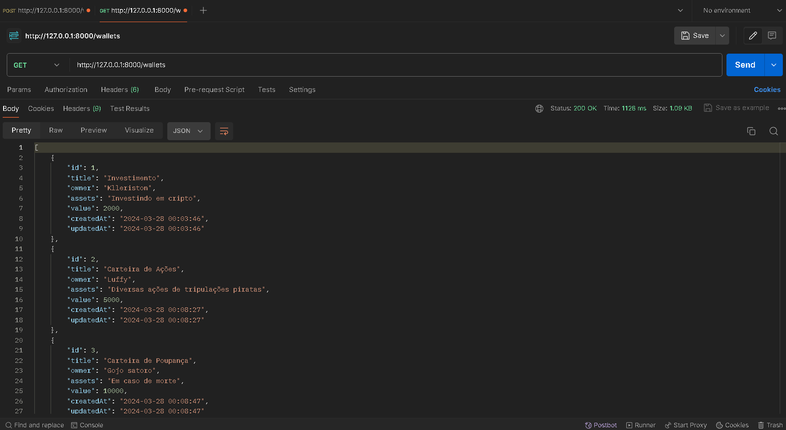
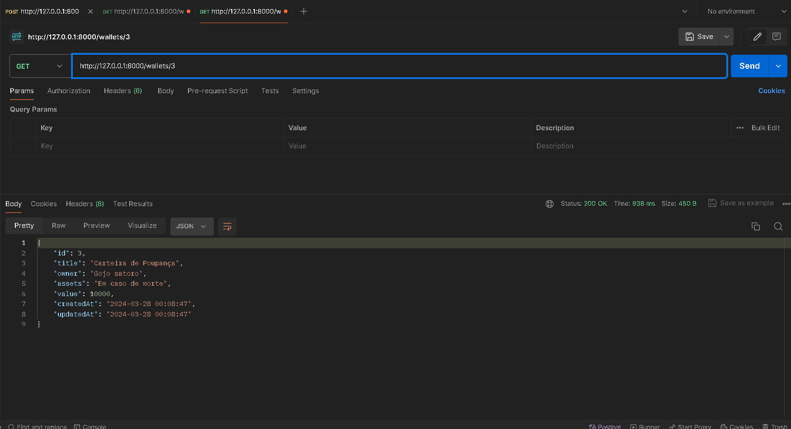
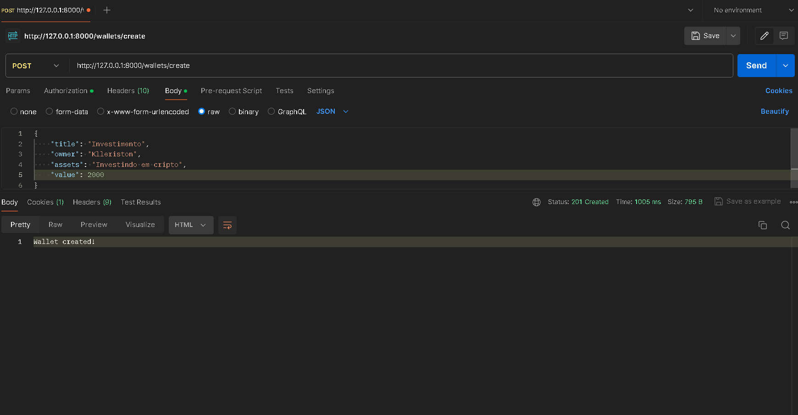
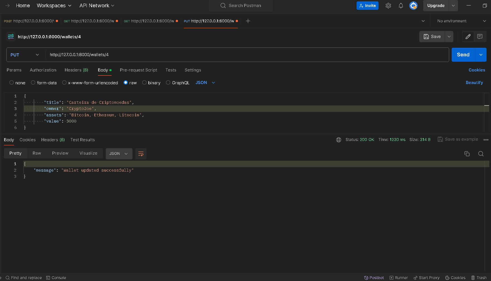

# Wallet CRUD PHP

Este é um projeto desenvolvido para aprimorar as habilidades no uso do framework Symfony e no mapeamento objeto-relacional com Doctrine ORM.

## Tecnologias Utilizadas
- Backend: PHP com Symfony
- Banco de Dados: PostgreSQL (utilizando Doctrine ORM)

## Endpoints:

### GET - Recuperar todos os registros

Este endpoint permite recuperar todos os registros armazenados na carteira.

### GET por ID - Recuperar um registro por ID

Permite recuperar um registro específico da carteira com base no seu identificador único.

### POST - Criar um novo registro

Este endpoint possibilita adicionar um novo registro à carteira.

### PUT - Atualizar um registro existente

Usado para atualizar um registro existente na carteira.

## Redes Sociais
- Github: [https://github.com/Klleriston](https://github.com/Klleriston)
- Linkedin: [https://www.linkedin.com/in/klleriston-andrade-860a22228/](https://www.linkedin.com/in/klleriston-andrade-860a22228/)
- Twitter: [https://twitter.com/devkekz](https://twitter.com/devkekz)
